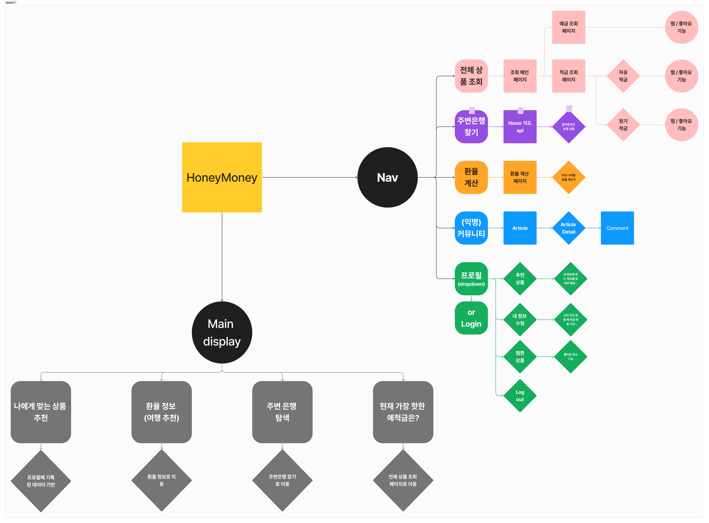
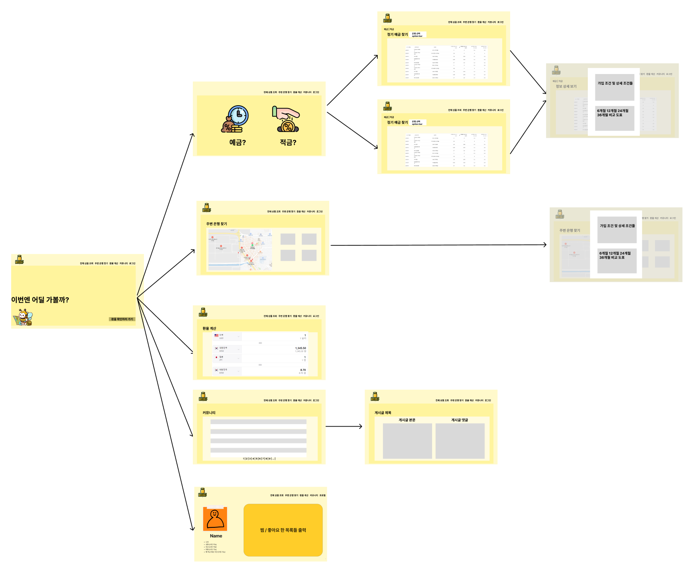
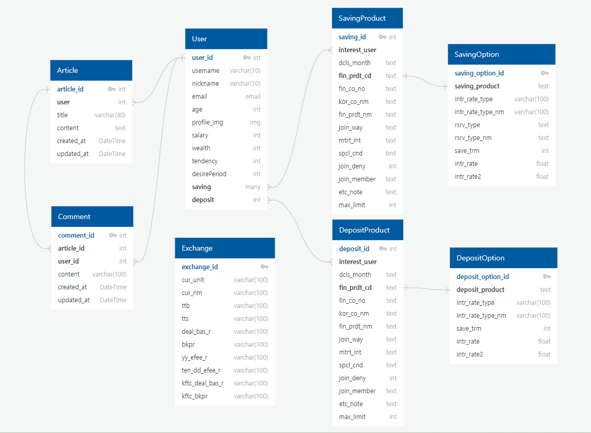

## 프로젝트 소개

<strong>나에게 맞는 금융 상품을 추천받자!😀</strong> 사용자 금융 정보와 HONEYMONEY의 모든 이용자의 데이터베이스를 통해 맞춤형 상품을 추천합니다.
|팀원|역할|
|------|---|
|박효진|Front-end 개발, UI/UX 디자인, Chatbot 프롬프트 엔지니어링|
|허세령|Back-end 개발, Chatbot, 환율 계산기, 추천 상품 페이지 Front-end 개발|

## 💻Tech Stack

### Language

    python
    javascript

### Back-end

    Django
    Django-rest-framework
    dj-rest-auth
    pillow

### Front-end

    Vue3
    vuetify
    pinia
    axios
    chart.js

## ✏️설계 기획 및 목업

#### 설계 아키텍처

#### 디자인 목업

## 📊ERD

## 금융 상품 추천 알고리즘

### 1. 나의 금융 정보와 비슷한 금융 정보를 가진 유저들이 가입한 상품 추천받기

😄사용자는 회원가입 시 연봉, 자산, 저축 성향, 저축 희망 기간을 입력합니다. 최소 10000명의 유저가 가입된 HONEYMONEY에서는 모든 사용자의 금융 정보를 기반으로 내 금융 정보 맞춤 상품 10개를 추천합니다.

### 2. 내 나이대의 사용자들이 가장 많이 가입한 상품 추천 받기

😄사용자가 회원가입 시 입력한 나이를 기반으로 상품을 추천합니다. HONEYMONEY 내 같은 나이 대의 유저들이 가장 많이 가입한 상품 10개를 추천합니다.

## 서비스 기능

- 예금, 자유 적금, 정기 적금 상품 모아보기

  - 금융 상품의 가입 기간 별 금리 비교
  - 모든 상품끼리의 금리 비교
  - 은행 별 상품 검색
  - 상품 리스트에서 나의 희망 적립 기간을 한 눈에 보기 쉽게!

- 주변 은행 검색하기
  - 카카오맵 API 활용
  - 도/시, 시/군/구 기준 원하는 은행 찾기
  - 은행 검색 시 은행이 가진 금융 상품 리스트 출력

- 환율 계산기
  - 송금 받을 때, 송금 보낼 때, 매매 기준율 기준으로 외화 -> 원화 계산
- 금융 상품 알고리즘 추천
  - 나와 비슷한 금융 정보를 가진 이용자들의 가입 상품
  - 내 나이대 이용자들의 가입 상품
- HONEYMONEY 커뮤니티 기능
  - 게시글 작성 및 댓글 작성
- 금융 상품 찜하기

  - 금융 상품 상세 페이지에서 상품 담기, 취소하기
  - HONEYMONEY 사용자 중 몇 명이 찜했는지 확인 가능
  - 기간 별 금리를 차트로 한 눈에 확인

- 유저의 프로필 페이지
  - 내 금융 정보 변경 가능
  - 회원 탈퇴 기능
  - 내가 담은 상품 목록 출력 (예금, 적금) 및 담기 취소
  - 내가 담은 상품 개수 확인 가능
- 금융 챗봇
  - 웹 사이트의 모든 화면에서 언제든지 챗봇과 대화하기 가능
  - 내 금융 정보를 기반으로 챗봇에게 금융 상품 추천받기

### 최종 진척도 (기능구현🟢5개=완료 / CSS🔵=완료 / 🤔🥲😀)

1. 회원가입 🟢🟢🟢🟢🟢🔵

2. 로그인 🟢🟢🟢🟢🟢🔵

3. 웹 소개 메인 🟢🟢🟢🟢🟢🔵

4. 금융 상품 조회
	4.a 금융 상품 조회 전 예,적금 선택 🟢🟢🟢🟢🟢🔵

	4.b 예금 상품 목록 🟢🟢🟢🟢🟢🔵

	4.c.1 자유 적금형 🟢🟢🟢🟢🟢🔵

	4.c.2 정기 적금형 🟢🟢🟢🟢🟢🔵

	4.d 상품 Detail 페이지 🟢🟢🟢🟢🟢🔵

5. 내 주변 은행 찾기 🟢🟢🟢🟢🟢🔵

6. 개인(신규) 프로필 정보를 통한 추천 알고리즘 🟢🟢🟢🟢🟢🔵

7. 환율 조회 🟢🟢🟢🟢🟢🔵

8. 커뮤니티
	8.a 게시글 조회 🟢🟢🟢🟢🟢🔵

	Creation 🟢🟢🟢🟢🟢🔵

	Read 🟢🟢🟢🟢🟢🔵

	Update 🟢🟢🟢🟢🟢🔵

	Delete 🟢🟢🟢🟢🟢🔵

	8.b 댓글 조회 🟢🟢🟢🟢🟢🔵

	Creation 🟢🟢🟢🟢🟢🔵

	Read 🟢🟢🟢🟢🟢🔵

	Update 🟢🟢🟢🟢🟢🔵

	Delete 🟢🟢🟢🟢🟢🔵

9. 개인 프로필 🟢🟢🟢🟢🟢🔵

10. 금융 상품 Chat Bot 🟢🟢🟢🟢🟢🔵

# Page Preview

## 1. 메인 페이지
https://github.com/piaoria/HoneyMoney/assets/155702981/8c616f09-6caa-49f8-9fc7-9b8d0640778d
- v-tab과 v-carousel을 이용한 메인페이지
- Tab을 클릭하거나 마우스 오버 시 carousel 화살표 호버. 클릭 시 동일하게 이동 가능
- 이미지는 https://www.bing.com/images/create 이용

## 2. 환율 페이지
https://github.com/piaoria/HoneyMoney/assets/155702981/ca6bdea3-6d13-4c20-bf8f-0861bc3fdb25
- v-form의 v-select을 통해 데이터 받아서 반응성 변수 활용
- front에서 api 직접 요청 x back으로 요청 o

## 3. 주변 은행 찾기 (비로그인 / 로그인)
https://github.com/piaoria/HoneyMoney/assets/155702981/e32e165f-2659-4d91-b9d9-a9e5a13d61e4
- KAKAO MAP API 사용
- 비로그인 시 로그인 팝업(1회)
- 로그인 하지 않아도 은행 검색 기능 활성화

https://github.com/piaoria/HoneyMoney/assets/155702981/74a90be2-715f-4fa9-8e4f-3ebc0359000a
- 로그인 권유 팝업을 통해 로그인 페이지 유도

https://github.com/piaoria/HoneyMoney/assets/155702981/c18ffae2-a16c-45cf-9bec-ff3e3137be4e
- 로그인 되어있을 경우 팝업이 뜨지않고 하단의 금융 상품 조회 가능

## 4-1. 회원가입 (성공)
https://github.com/piaoria/HoneyMoney/assets/155702981/2afaf557-13cf-4453-b6be-550f3d0cf80f
- 로그인 창의 회원가입 또는 modal을 통해 이동 가능
- 필수 데이터* 확인
- 약관 동의 확인
- 자동 로그인

## 4-2. 회원가입 (오류)
https://github.com/piaoria/HoneyMoney/assets/155702981/d316a261-97a8-4a43-ba92-3110a675f893
- Vuelidate 라이브러리를 통해 Front에서 1차 유효성 검사 실시
- 비밀번호 자리수를 만족하지 못하거나 다른 비밀번호 입력시 error 발생

https://github.com/piaoria/HoneyMoney/assets/155702981/ea81e8f2-45cb-4948-a9a6-777bcea80fb0
- 입력값 범위 설정 가능 (- 값 사용 불가)
- 필수 데이터 미 입력시 alert를 통한 알람

https://github.com/piaoria/HoneyMoney/assets/155702981/9ab7e1b2-72ed-42e1-a7b0-d5e61d7e652f
- 약관 미 동의시 확인 메세지 알람
- Username 중복 시 메세지 알람

## 5. 로그인
https://github.com/piaoria/HoneyMoney/assets/155702981/3757a94e-d6e4-43e1-a024-d35d102c6d59
- Vuelidate를 통해 1차 유효성 검사
- 비밀번호 input 중, type visible 토글
- 로그인 완료 시 환영 문구 출력

## 6. 프로필 변경
https://github.com/piaoria/HoneyMoney/assets/155702981/662541e9-8bd8-4ec0-ad74-201ca221f4a5
- Edit Profile을 통해 변경(dialog)
- 회원 프로필 사진 변경 가능

## 7. 댓글 CRUD
https://github.com/piaoria/HoneyMoney/assets/155702981/cbe5f03a-badd-4024-a660-382385468801
- hint를 통해 UX 향상
- 새로고침 없는 Create, Read, Delete
- 수정 시 dialog를 통해 실시간 수정 가능
- 댓글 작성자 권한 부여

## 8. 게시글CRUD + 댓글(작성자 구분)
https://github.com/piaoria/HoneyMoney/assets/155702981/9371c743-4622-4ece-93e0-b0fc97482d92
- 게시글 생성 페이지와 수정 페이지 
- 게시글 작성자 권한 부여
- 댓글 없을 시 특정 문구 출력
- 글 작성자와 댓글 작성자가 동일할 경우 글씨 색상과 하이라이트 표시

https://github.com/piaoria/HoneyMoney/assets/155702981/ebb1e09e-1236-4b13-a1fd-cdb8998e30b2
- 삭제 시도 시 적절한 alert 사용
- 삭제 후 게시글 List로 이동
- 포함된 댓글 자동 삭제

## 9. 예금 리스트
https://github.com/piaoria/HoneyMoney/assets/155702981/a387aeb1-7a2e-4ad0-b738-dae1af58477f
- 예금 / 적금 선택 페이지
- v-data-table-virtual을 통해 데이터 테이블 제작
- 가입시 기입한 유저 desire Period를 사용한 테이블 하이라이트 (예시 24개월)

https://github.com/piaoria/HoneyMoney/assets/155702981/bf69b2b1-f8dd-48c9-8a6c-448a0ef67dff
- 데이터 가공을 통해 6, 12, 24, 36 개월 데이터 추출
- sort 가능
- 하이라이트된 데이터의 수치별 색상 표시 (3이상 초록색, 이하 주황색)

https://github.com/piaoria/HoneyMoney/assets/155702981/7fde8ee5-a1db-4421-a898-e56d9c5090b9
- 은행별 금융 상품 조회 가능

## 10. 적금 리스트
https://github.com/piaoria/HoneyMoney/assets/155702981/5d835899-793c-4806-9b52-4d7e82f82eb8
- 자유 적립식, 정액 적립식 분류
- 은행별 금융 상품 조회 가능
- 유형 토글 가능

## 11. 상품 Detail
https://github.com/piaoria/HoneyMoney/assets/155702981/9028eced-ca27-4017-a8a6-3b8a31d541a2
- 상품 명 클릭을 통해 예금의 세부 내용 확인
- 기간별 금리(기본 금리 + 최고 우대 금리) 막대 그래프 비교
  
https://github.com/piaoria/HoneyMoney/assets/155702981/cb80e5e6-e273-4612-9f0f-274bdaeacee5
- 상품 명 클릭을 통해 적금의 세부 내용 확인
- 자유적립식, 정액적립식 tab 기능
- 자유적립식과 정액적립식 막대 그래프 한눈 비교
- 우측 상단 꿀통 버튼 클릭을 통해 꿀통에 담기 가능
- 꿀통 추가 / 제거 적절한 애니메이션

## 12. Profile 페이지 (담은 꿀통 확인 및 삭제)
https://github.com/piaoria/HoneyMoney/assets/155702981/c6e66cab-1809-42d6-b624-7ac638ed30f6
- 실시간 꿀통에 담은 예금(위) / 적금(아래) 확인 가능
- carousel을 통한 UX 향상
- 상품 Detail 확인 가능
- 카드의 X 표시를 통해 쉬운 삭제 가능
- 카드 좌측 위 꿀통 그림속 카드 갯수 출력
- 담긴 꿀통의 은행 로고 출력

## 13. Recommend Page
https://github.com/piaoria/HoneyMoney/assets/155702981/b522c7db-25aa-4906-8591-a2f9f68db7db
- 자산, 연봉, 희망기간 등 개인 정보에 맞춤 추천 서비스
- 예금 / 적금 한눈에 확인 가능
https://github.com/piaoria/HoneyMoney/assets/155702981/1f0c87f8-6ce1-4bf0-a86e-744fd8436533
- 연령대 별 추천 서비스
- 예금 / 적금 한눈에 확인 가능

## 14. Profile 변경 후 Recommend Page
https://github.com/piaoria/HoneyMoney/assets/155702981/c417b204-e560-44bc-b0d1-7d9bd4523263
- Profile 변경 후 실시간 적용되는 Recommend 상품
- 변경사항 적용되는 희망기간 하이라이트

## 15. AI ChatBot
https://github.com/piaoria/HoneyMoney/assets/155702981/0b382da9-069a-42a4-8385-a2e07a504f50
- v-show + dialog 활용
- GPT-4 사용 (개인 API 키)
- Prompt Engineering을 통한 금융 챗봇 최적화

https://github.com/piaoria/HoneyMoney/assets/155702981/a4967a61-ea72-47a4-9c6a-58259cd560e0
- 나이, 연봉, 재산, 희망 기간에 따른 개인 계정에 맞춤 데이터 사용

https://github.com/piaoria/HoneyMoney/assets/155702981/72cae23e-28f3-4e16-a9df-3d0c31dacb72
- 부족한 정보 (URL, 전화번호) 추가 제공
- URL 제공을 위한 데이터 가공

## 16. 회원탈퇴
https://github.com/piaoria/HoneyMoney/assets/155702981/860af049-182b-439d-a096-7e799c5de4aa
- 프로필 설정에서 회원탈퇴 가능
- 취소 / 확인 시 적절한 alert 설정

https://github.com/piaoria/HoneyMoney/assets/155702981/df809d26-3f7e-4034-a053-20dbe05d2898
- 계정 데이터 삭제 확인
- 이전 게시한 게시글, 댓글 모두 자동 삭제

# 후기

### 🙋🏻박효진
시작부터 말하지 않아도 분업이 정해져서 신기했고, 믿을만한 팀원을 만나 마음껏 프론트에 집중할 수 있어서 너무 재밌었다. front에서 사용하기 위한 db를 모두 구축해둔 덕분에 막힘 없이 진행할 수 있었다..

앞선 기수분들이 사용했던 stack을 쓰겠다고 당차게 시작했지만, Vuetify의 벽은 너무 높았다. 물론 부트스트랩과 동일한 부분도 많았지만, 스피너나 다이얼로그 등이 영어 단어가 달라서 docs보는데 시간이 조금 걸렸다.

지금까지 배웠던 기술 및 스택 들을 사용해보는 과정이어서 더 재미있었고, 알고리즘까지 빠지지 않고 등장해서 반가웠다. 또한 front는 굉장히 주관적인 요소라 fix하는대까지 너무 긴 시간이 걸렸고, 표현 요소를 제대로 못할때마다 답답함이 많았다. 

빠르게 back을 끝내고 front를 도와준 페어에게 고맙고, 고마운 만큼 전반적인 디자인을 깔끔하게 했다고 개인적으론 생각한다. 굉장히 만족스러운 프로젝트였고, 포트폴리오로 쓰기에 흠집없는 결과물이라고 자부할 수 있다.

가장 재미있었던 것은 의외로 AI Chat Bot인데, css는 디자인 하는 것이라 질리는 감이 있었는데, 직접 Chat Bot을 훈련시켜 원하는 대답과 유저 정보를 미리 넘겨주어 사용자 UX를 향상시킬 수 있다는 점이 매력적이었다. 파인 튜닝을 진행하고 싶었으나 데이터를 모두 준비해둔 상태에서 시작하려니, 유료였다는 점에서 포기한게 아쉬웠다.. 다음 프로젝트에는 AI요소를 이용한 작은 프로젝트를 진행해보고 싶다.

### 🙋🏻허세령

개발자의 분업과 협업이 이런 것인가? 프로젝트를 진행하면서 역할 분담이 쉽지 않을 것이라 생각했지만, 서로 각자의 역할을 120% 해주면서 처음부터 끝까지 순조롭게 흘러갈 수 있게 해준 페어에게 고맙습니다!  코드 오류 찾는 게 힘들었지, 팀워크는 완벽했다!

한 학기 동안 배우면서 ‘이런 건 굳이 왜 쓰지?’ 라고 생각했던 것들이 이해되기도 하고, 새로운 라이브러리를 쓰면서 docs 보는 능력이 생긴 것 같다.

특히, front-end 구축이 점차 진행되면서 컴포넌트의 필요성을 뼈저리게 느꼈다. 우리 프로젝트는 재사용 따위는 없는 빡하드코딩이다. 이번 프로젝트를 계기로 다음번엔 컴포넌트를 적극 활용해서 클린 코딩에 가까워 지도록 해야겠다.

일주일동안 에이바우트에 살면서 앞이 안보일 정도로 피곤에 쩔었지만, 시간 가는 줄도 모르고 결과물 보면서 뿌듯해 했다. 재밌고 후회 없이 내 인생 첫 프로젝트를 완성할 수 있음에 감사하다! 😄
